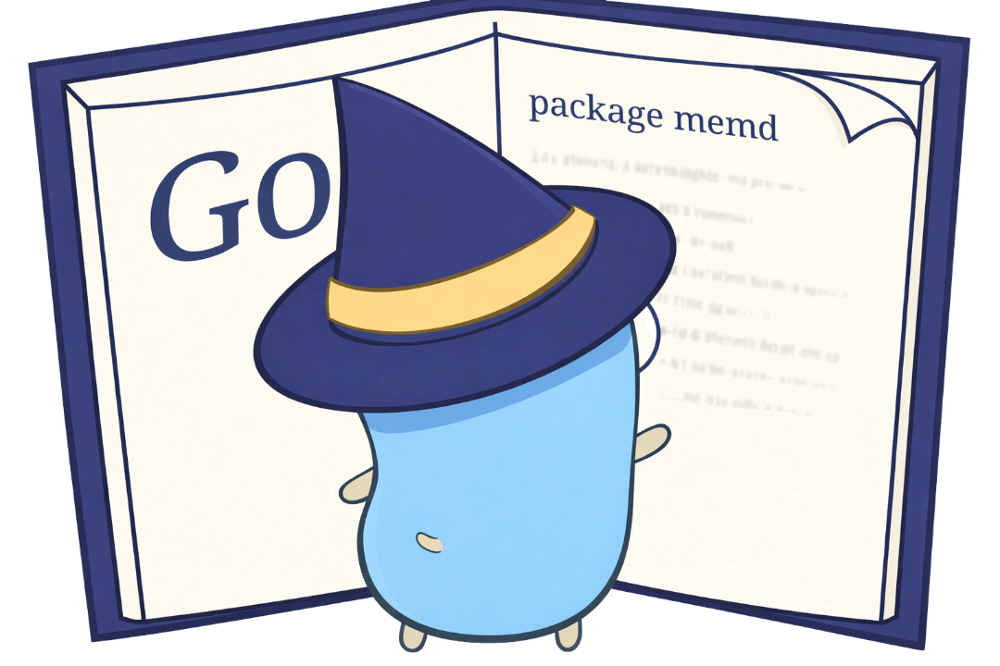

# memd



Local-first context memory for AI coding agents.

Human-readable · Inspectable · No cloud · No hidden state

## Overview

`memd` is a CLI for managing context memory used by AI coding agents.

It is transparent and predictable by design. Your data lives locally, and you can inspect it at any time.

## Goals

- **Local-first** — state lives on your machine, not in the cloud
- **Inspectable** — simple, human-readable storage
- **Minimal CLI surface** — a small, focused command set
- **Boring by design** — predictable behavior over clever abstractions

## Requirements
- Go `1.25` or newer

Verify your installed version:

```bash
go version
```

## Installation

Clone the repository:

```bash
git clone https://github.com/sojournerdev/memd.git
cd memd
```

Build locally (binary stays in this directory):

```bash
go build -o memd ./cmd/memd
./memd help
```

Install globally (adds `memd` to your `$PATH` via `$GOBIN` or `$GOPATH/bin`):

```bash
go install ./cmd/memd
memd help
```

## Usage

```bash
memd help       # Show available commands
memd version    # Print version information
memd doctor     # Validate local configuration
```

### Verifying your setup

Run `memd doctor` to confirm your installation and see where state is stored:

```bash
$ memd doctor
OK
state_dir:    /home/marcos/.local/state/memd
db_path:      /home/marcos/.local/state/memd/memd.db
blobs_dir:    /home/marcos/.local/state/memd/blobs
journal_mode: wal
sqlite_ver:   3.51.2
foreign_keys: true
busy_timeout: 5000ms
synchronous:  NORMAL (1)
db_writable:  true
```

## Data Storage

`memd` follows platform conventions for local application state:

| Platform | Default path                         |
| -------- | ------------------------------------ |
| Linux    | `~/.local/state/memd`                |
| macOS    | `~/Library/Application Support/memd` |
| Windows  | `%AppData%\memd`                     |

The storage directory contains:

- `memd.db` — SQLite database for structured state
- `blobs/` — directory for raw content blobs

## Status

**Early development.** CLI scaffolding is in place. Core interfaces may change before a stable release.

## Contributing

This is currently a solo project. Issues and pull requests are welcome.

## Attribution

The Go Gopher was originally created by Renee French.  
Image sourced from [egonelbre/gophers](https://github.com/egonelbre/gophers) (CC0).  
Go and the Go Gopher are trademarks of Google LLC.

## License

Licensed under the [Apache License 2.0](./LICENSE).
