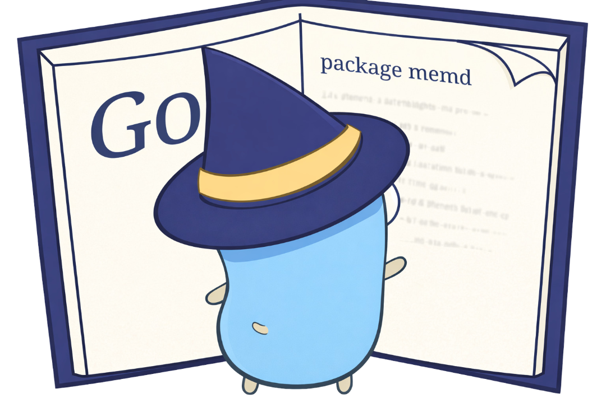

# memd



Local-first context memory for AI coding agents.

Human-readable · Inspectable · No cloud · No hidden state

## Overview

`memd` is a CLI for managing context memory used by AI coding agents.

It is transparent and predictable by design. Your data lives locally, and you can inspect it at any time.

## Goals

- **Local-first** — state lives on your machine, not in the cloud
- **Inspectable** — simple, human-readable storage
- **Minimal CLI surface** — a small, focused command set

## Requirements
- Go `1.26` or newer

Verify your installed version:

```bash
go version
```

## Installation

Clone the repository:

```bash
git clone https://github.com/sojournerdev/memd.git
cd memd
```

For development, use the Makefile:

```bash
make dev
```

This runs the usual local checks and installs `memd` with build metadata.

Install globally (adds `memd` to your `$PATH` via `$GOBIN` or `$GOPATH/bin`):

```bash
go install ./cmd/memd
memd help
```

## Quick Start

Initialize local state:

```bash
memd init
```

Verify your setup:

```bash
memd doctor
```

Index the current repository:

```bash
memd ingest .
```

For a step-by-step setup guide with expected output, storage details, and troubleshooting, see [Getting Started](./docs/getting-started.md).

## Commands

```bash
memd help       # Show available commands
memd init       # Initialize local memd state and schema
memd ingest .   # Index a repository into local searchable memory
memd version    # Print version information
memd doctor     # Validate local configuration
```

## Documentation

- [Getting Started](./docs/getting-started.md) — installation, first run, storage, and troubleshooting

## Developer Workflow

Use the Makefile for common local tasks:

```bash
make dev
make ci
```

- `make dev` runs the usual local development steps and installs the CLI
- `make ci` runs the stricter CI checks

If you just want a local development install, start with `make dev`.

## Status

**Early development.** The current CLI can initialize local state, run health checks, and ingest repositories into local searchable memory. Core interfaces may still change before a stable release.

## Current Limits

- There is no command yet to query, search, or bundle stored data.
- Ingest currently uses a fixed list of supported file extensions
- Some CLI behavior and storage details may still change

## Contributing

Issues and pull requests are welcome!

## Attribution

The Go Gopher was originally created by Renee French.  
Image sourced from [egonelbre/gophers](https://github.com/egonelbre/gophers) (CC0).  
Go and the Go Gopher are trademarks of Google LLC.

## License

Licensed under the [Apache License 2.0](./LICENSE).
