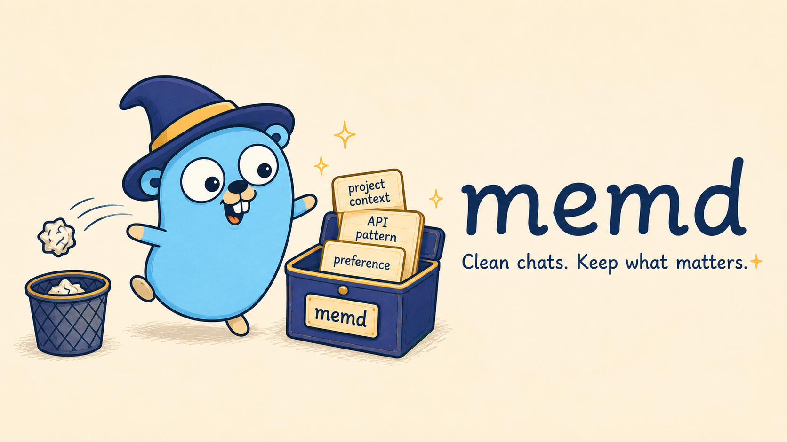

# memd

<p align="center">
  
</p>

## Overview

`memd` lets you save useful context from AI chats and reuse it later.

`memd` comes from my OCD of cleaning up conversations when I use Codex. As I
write this, my understanding is that you can't delete chats inside the VS Code
extension and have to go to the backend of Codex, where it stores your chat
sessions on disk. So I thought it would be nice to delete them inside VS Code
using tool calls. The added benefit is saving helpful info that I want to pull
in later.

## Goals

- Save useful context from AI chats so it can be reused later.
- Help keep chat history clean without losing important details.
- Store memories locally in a format that is easy to inspect.
- Expose an MCP surface that AI clients can use directly.

## Non-Goals

- Replace a full notes app or knowledge base.
- Store entire chat transcripts by default.
- Sync memories across machines.
- Decide automatically what should be remembered without user review.

## How It Works

`memd` runs as a local MCP server using stdio. At the moment, it does not
support other implementations of the MCP protocol.

Current tools:

- `create_memory`: save useful context for later.
- `search_memories`: search saved memories by topic.

## Requirements

- Go `1.26.3` or newer
- An MCP-capable client for interactive use

## Quick Start

Example VS Code workspace config:

```json
{
  "servers": {
    "memd": {
      "type": "stdio",
      "command": "go",
      "args": ["run", "./cmd/memd"],
      "cwd": "${workspaceFolder}"
    }
  }
}
```

Example Codex local config:

```toml
[mcp_servers.memd]
command = "go"
args = ["run", "./cmd/memd"]
cwd = "/path/to/memd"
```

## Development

```sh
make       # builds and starts the MCP stdio server.
make build # runs formatting, vet, tests, and builds `./.bin/memd`.
make run   # builds and starts the local MCP stdio server.
make ci    # runs the stricter local CI path.
```

## Documentation

- [Architecture](./docs/ARCHITECTURE.md)

## Status

`memd` currently supports creating and searching local memories through MCP.
This is no logic of cleaning up conversations after a chat has been saved as a memory.

## License

Licensed under [MIT](./LICENSE).
