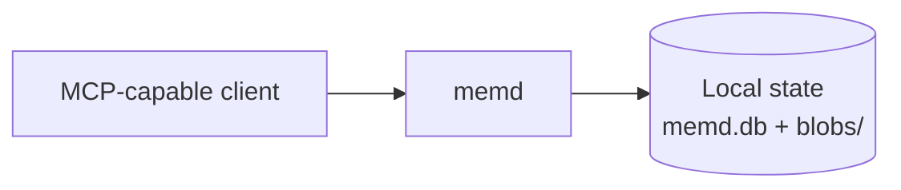
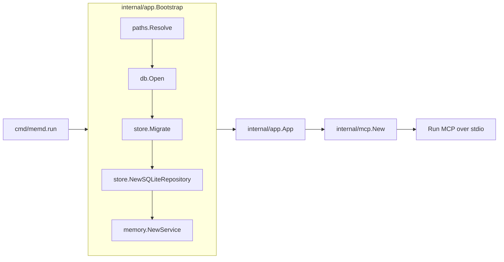
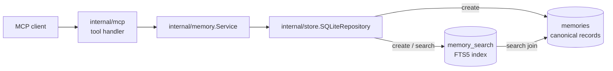

# Architecture

## Purpose

This document explains how `memd` is built today. It is for developers who need
to understand the system before changing it.

For product goals, setup, and development commands, see
[README.md](../README.md).

## Overview

`memd` is a local MCP server for saving useful context from AI chats and finding
it again later. It runs as one Go process, communicates with clients over MCP
stdio, and stores data in a local SQLite database.

The system has two current use cases:

- Create a memory with `create_memory`.
- Search memories within a project with `search_memories`.

## System Context



`memd` sits between an MCP-capable client and local state on the same machine.
It does not call remote services or depend on external infrastructure during
normal operation.

## Architectural Drivers

The current architecture is shaped by these goals and constraints:

- Keep data local and easy to inspect.
- Keep the runtime simple enough for a single-user MVP.
- Separate transport, domain logic, and persistence concerns.
- Scope retrieval by project so unrelated memories do not mix together.
- Avoid external services unless the product needs them later.

## Runtime Views

### Startup Flow



`internal/app.Bootstrap` is the startup coordinator. It resolves the default
paths, delegates resource creation to `BootstrapPaths`, and returns the fully
wired application state used by `cmd/memd`. The diagram groups those internal
steps so the main lifecycle stays easy to scan.

### Request Flow



The main runtime boundary is between transport, domain logic, and persistence:

- `internal/mcp` handles MCP-specific behavior.
- `internal/memory` defines the domain model and service boundary.
- `internal/store` contains SQLite-specific behavior.

## Lifecycle

The executable entrypoint is `cmd/memd`.

At startup, the process creates a signal-aware context, builds the application
through `internal/app`, and starts the MCP server over stdio.

When a tool is called, `internal/mcp` validates and normalizes the request,
passes domain input into `internal/memory.Service`, and maps the domain result
back into an MCP response after persistence work completes in `internal/store`.

### Shutdown

The server stops when the MCP client disconnects or the root context is
canceled. The app then closes the SQLite connection it owns.

## Package Responsibilities

| Package | Responsibility |
| --- | --- |
| `cmd/memd` | Process entrypoint and shutdown handling |
| `internal/app` | Dependency wiring and ownership of long-lived resources |
| `internal/mcp` | MCP server setup, tool handlers, validation, and response mapping |
| `internal/memory` | Domain types, repository interface, and service layer |
| `internal/store` | SQLite repository, SQL queries, and migrations |
| `internal/db` | SQLite connection setup and connection-level settings |
| `internal/paths` | Runtime path resolution and filesystem validation |

## Data Model

The core domain object is `Memory`.

| Field | Meaning |
| --- | --- |
| `ID` | System-generated memory ID |
| `ProjectKey` | Project or workspace scope used during retrieval |
| `Title` | Short human-readable label |
| `Summary` | Short retrieval-oriented description |
| `Content` | Full saved memory |
| `CreatedAt` | Creation timestamp |
| `UpdatedAt` | Last update timestamp |

The domain layer uses `CreateInput` and `SearchInput` for incoming requests.
`memory.Repository` hides storage details from the domain service, so the memory
package does not depend on SQLite.

## Storage

### Local State

`internal/paths` resolves state in this order:

1. `MEMD_HOME`
2. `XDG_STATE_HOME/memd`
3. OS defaults

The current state layout is:

```text
<state-dir>/
  memd.db
  blobs/
```

`memd.db` stores memory data. `blobs/` is reserved in the layout but is not used
by the current workflow. The state and `blobs/` directories are created with
owner-only permissions.

### SQLite Schema

SQLite uses two main structures:

| Structure | Purpose |
| --- | --- |
| `memories` | Canonical memory records |
| `memory_search` | FTS5 search index over memory text |

Creating a memory writes to both structures in one transaction, which keeps the
saved record and the search index aligned.

The search index covers `title`, `summary`, and `content`.

Search behavior is project-scoped:

- The query matches the FTS5 index.
- Results must match the requested `project_key`.
- Results are ordered by FTS rank, then newest update time, then memory ID.

Migrations are embedded in the binary, run in version order during startup, and
record checksums. If an applied migration file changes later, startup fails
instead of silently accepting a changed schema history.

## Public Interface

### Transport

`memd` currently supports MCP over stdio only.

### Tools

| Tool | Purpose |
| --- | --- |
| `create_memory` | Save a new memory |
| `search_memories` | Search saved memories within one project |

The MCP layer trims string input, rejects missing required fields, sets a default
search limit of `10`, and caps search results at `50`.

## Architecture Decisions

### Local-First Storage

Local storage keeps the system simple to run, easy to inspect, and usable
without a hosted service.

### SQLite With FTS5

SQLite provides transactional local storage in one file. FTS5 adds text search
without requiring a separate search system.

### Repository Boundary

The repository interface keeps storage details out of the domain layer. That
makes the core use cases easier to test and leaves room for another storage
implementation later.

### Project-Scoped Search

Every search requires a `project_key`. This prevents unrelated memories from
different workspaces from mixing together by default.

## Operational Characteristics

| Concern | Current behavior |
| --- | --- |
| Process model | Single local process |
| Transport | MCP stdio |
| Database mode | SQLite WAL mode with foreign keys enabled |
| Connections | One open and one idle SQLite connection |
| Migrations | Applied during startup |
| Logging | Structured `slog` logs around startup and MCP tool calls |
| Startup failures | Path, database, or migration failures stop startup |

## Known Limitations

- Memories can be created and searched, but not updated or deleted.
- Chat cleanup is not implemented yet.
- Search is lexical FTS search, not semantic search.
- The current design is for local single-user use.

## Change Guidance

When extending `memd`:

- Keep MCP-specific behavior in `internal/mcp`.
- Keep domain types and interfaces in `internal/memory`.
- Keep SQLite-specific logic in `internal/store`.
- Add schema changes through migrations.
- Update this document when runtime flow, package boundaries, storage layout, or
  public interfaces change.
